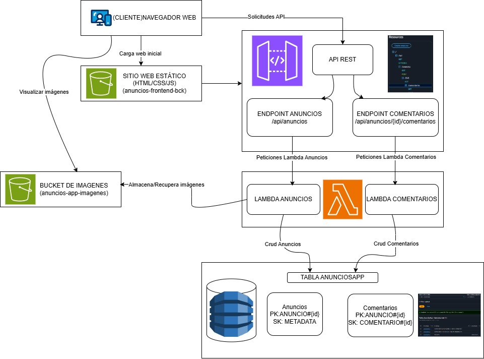
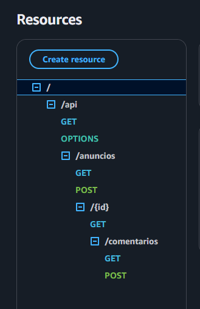
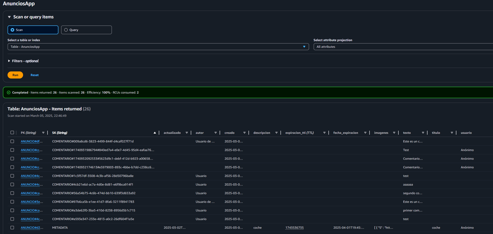

# Introducción AWS

## Diseño de la arquitectura: 

Considero que el diseño es bastante simplista pero eficaz, es totalmente serverless lo que ayuda a que tenga gran escalabilidad (realmente no requerida para el caso de uso) y bajo coste. Principalmente hace uso de 4 componenes que son detallados a continuación:

##### S3:
He optado por hacer uso de S3 tanto para alojar el HTML como para almacenar las imágenes de los anuncios. El código HTML de la aplicación está alojado en un bucket S3 dedicado, mientras que las imágenes subidas por los usuarios se almacenan en un bucket separado, permitiendo una clara separación de responsabilidades pero haciendo uso de un mismo servicio para el frontend. Respecto al uso del componente en el proyecto, destacar:

  - Las imágenes de los anuncios se almacenan en S3, donde automáticamente reciben URLs públicas accesibles directamente desde el frontend.
  - La monitorización se simplifica enormemente, ya que todo lo relacionado con el frontend (código e imágenes) puede supervisarse de forma centralizada desde CloudWatch.
  - Se facilita la gestión de permisos, pudiendo aplicar políticas específicas para cada tipo de contenido mientras se mantiene una base tecnológica común.
  - Además de los beneficios estándar de S3 (alta disponibilidad, escalabilidad automática, etc...), esta configuración minimiza los costos operativos cuando la aplicación no tiene tráfico.
  - La implementación resulta más sencilla gracias a la capacidad de S3 para funcionar como alojamiento web estático, que elimina la necesidad de un servidor web tradicional.

En resumen, he considerado que con S3 se puede obtener una solución serverless completa para el frontend, optimizando costos y simplicidad operativa.

##### API Gateway:
Para el componente backend de la aplicación, he decidido implementar API Gateway como intermediario entre el frontend y las funciones Lambda por varias razones estratégicas:

  - Gestión centralizada de endpoints: el servicio me permite definir, organizar y mantener todos los endpoints de la API en un solo lugar.
  - Acceso unificado a los endpoints, de manera natural se proporciona una capa de seguridad para implementar autorización y control de acceso para todos los endpoints sin modificar el código de las funciones Lambda.
  - Al igual que el resto de tecnologías empleadas, sigue el modelo de pago por uso, por lo que si no recibe peticiones no aumenta el costo.
  - Habilita el uso de la caché por lo que reduce el número de peticiones a las lambdas, lo que deriva en mejor rendimiento y menor costo.
  - Fácil integración con Firewall (WAF), posibilitando la protección de los acceso de manera muy fácil.

*Posibles mejoras*
  - De ser necesario (no implementado), podría integrar el servicio con CloudFront, lo que podría simplificar aún más la arquitectura pues sería el único punto de entrada del frontend. Además posibilita configurar múltiples etapas de desarrollo simultáneamente, por si quisiera hacer el despliegue de manera progresiva en entornos diferentes (esto me ha permitido dejar inaccesible la web de manera fácil). 

En conclusión, el servicio facilita y simplifica mucho la creación de endpoints(requeridos) y lo que ello conlleva.

  

##### Lambda:
Este servicio ha servido como pilar fundamental para  la lógica del backend, distribuida en 2 funciones diferentes, una para la gestión de comentarios  y otra para el resto de funcionalidades, que a su vez estas podrían haberse segregado en otras lambdas pero por mantener la simplicidad he considerado que no es necesario.
Se ponen en funcionamiento tras la llamada de la API e interactúan con Dynamo para el almacenamiento persistente (detallado a continuación) y con S3 para gestionar las imágenes.

Por detallar el código implementado en cada lambda, destacar que la primera (anuncios-lambda) se encarga de:
  - Listar los anuncios y la información relacionada, para ello recupera el contenido de Dynamo y lo transforma en formato óptimo para el front (JSON).
  - Crear anuncions mediante la generación de un nuevo registro que es insertado en Dynamo. 
  - Gestiona las imágenes, el JS previo las convierte en formato base64 y las envía en el JSON a la lambda (mediante la API) y es esta la que las procesa y las organiza en S3 mediante un sistema jerárquico que se basa en la ID del anuncio. Además general la URL de acceso y la almacena en el registro de la Dynamo.

La segunda lambda (comentarios-lambda):
  - Recibe las solicitudes HTTP a través de la API (/api/anuncios/{id}/comentarios) y en función de la operación recibida (GET/POST) verifica que el anuncio existe y consulta todos los comentarios asociados a este o crea un nuevo comentario con un sencillo proceso que genera el ID y lo almacena en Dynamo asociandolo al anuncio.

  He decidido usar lambda como core del backend por diversas razones, más allá de las virtudes del servicio (alta disponibilidad, pago por uso,etc...) para este caso concreto, tiene perfecta integración que tiene con el resto de servicios empleados, y me ha permitido ejecutar código sin tener que realizar prácticamente ningún tipo de configuración, cuestión que he considerado fundamental para implementar el backend. 

##### Dynamo:
Dynamo ha sido el componente elegido como pieza fundamental para el almacenamiento persistente, principalmente por las siguientes razones:
  - Permite estructurar toda la información requerida en una única tabla con claves compuestas, lo que da facilidad a la hora de gestionar los datos con una única operación(en casos de uso como este donde no se requiere una estructura compleja).
  - Posibilita la implementación directa de varias características  requeridas como la clave de partición, la clave de ordenación y sobre todo el tiempo de expiración del registro de manera autónoma (sino habría que implementarlo de manera manual, mediante una lambda por ejemplo).

De esta manera, este servicio cumple con los requisitos, ya que proporciona el almacenamiento necesario de manera óptima y permite una integración clara con el resto de los servicios. Además, su elección sigue la misma línea que los anteriores: simplicidad en la implementación, fácil integración, arquitectura completamente serverless.

-------------------
 
[Página web de anuncios](https://anuncios-frontend-bck.s3.eu-west-1.amazonaws.com/index.html)

